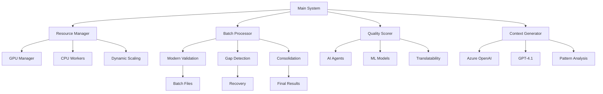

# 🔧 Technical Documentation - Multi-Agent Terminology Validation System

## 📋 Table of Contents

1. [System Architecture](#system-architecture)
2. [Core Components](#core-components)
3. [Processing Pipeline](#processing-pipeline)
4. [Gap Detection & Recovery](#gap-detection--recovery)
5. [Performance Optimization](#performance-optimization)
6. [Quality Assurance](#quality-assurance)
7. [Context Generation](#context-generation)
8. [Error Handling](#error-handling)
9. [API Reference](#api-reference)
10. [Configuration Guide](#configuration-guide)
11. [Troubleshooting](#troubleshooting)

## 🏗️ System Architecture

### High-Level Overview

```
┌─────────────────┐    ┌─────────────────┐    ┌─────────────────┐
│   Input Data    │───▶│  9-Step         │───▶│  Output Data    │
│   (CSV)         │    │  Pipeline       │    │  (JSON/CSV)     │
└─────────────────┘    └─────────────────┘    └─────────────────┘
                              │
                              ▼
                    ┌─────────────────┐
                    │  AI Agents &    │
                    │  ML Models      │
                    │  GPT-4.1        │
                    └─────────────────┘
```

### Component Interaction



## 🔧 Core Components

### 1. Main Orchestrator (`agentic_terminology_validation_system.py`)

**Purpose**: Central coordinator for the entire 9-step validation pipeline

**Key Classes**:
- `AgenticTerminologyValidationSystem`: Main system class with 9-step workflow
- `OrganizedValidationManager`: Batch processing coordinator

**Key Methods**:
```python
def step_7_final_review_decision(self, verified_file: str, translation_results_file: str = None) -> str:
    """
    Step 7: Final Review and Decision with PROPER Modern Validation Batch Processing
    
    Features:
    - PROPER batch processing via EnhancedValidationSystem.process_terms_parallel()
    - Organized folder structure with batch files, logs, and cache
    - Modern terminology review agents processing each batch
    - ML-based quality scoring and advanced context analysis in batch workers
    - Integration of Step 5 (translation) and Step 6 (verification) data
    - Comprehensive translatability analysis and NEW TERM verification
    - Consolidation of batch results into final decisions
    - Dynamic resource allocation based on system specifications
    
    Returns:
        str: Path to final decisions file
    """
```

**Step 9 Implementation**:
```python
def step_9_approved_terms_csv_export(self, decisions_file: str) -> str:
    """
    Step 9: Approved Terms CSV Export
    - Export approved terms to CSV format matching reviewed/ folder structure
    - Use Azure OpenAI GPT-4.1 to generate professional contexts from original texts
    - Filter for fully approved and conditionally approved terms
    - Parallel processing with system-optimized workers
    """
```

**Gap Detection Logic**:
```python
# Enhanced gap detection with content-based verification
def _detect_completed_steps(self):
    # Step 7 content verification
    if step == 7 and file == 'Final_Terminology_Decisions.json':
        with open(file_path, 'r', encoding='utf-8') as f:
            data = json.load(f)
        
        # Check for decisions data
        final_decisions = data.get('final_decisions', [])
        modern_summary = data.get('modern_validation_summary', {})
        total_decisions = modern_summary.get('total_decisions', len(final_decisions))
        
        # Load Step 6 results to check expected count
        expected_terms = len(step6_verified_results)
        
        if total_decisions >= expected_terms:
            # Actually complete
        else:
            # Incomplete - continue processing
```

### 2. Resource Manager (`ultra_optimized_smart_runner.py`)

**Purpose**: Dynamic resource allocation and GPU/CPU optimization with multi-model support

**Key Features**:
- Automatic GPU detection and configuration (up to 3 GPUs)
- Dynamic worker allocation based on system specifications
- Memory management and crash prevention
- Advanced checkpoint management
- NLLB-200 model optimization

**Configuration Logic**:
```python
def _detect_and_configure_gpus(self):
    """
    Detects available GPUs and configures optimal settings
    Supports multi-GPU setups for parallel translation processing
    
    Returns:
        dict: GPU configuration with worker counts and batch sizes
    """
    
    # Multi-GPU detection
    gpu_count = torch.cuda.device_count()
    
    if gpu_count >= 3:
        # High-end multi-GPU setup
        return {
            "gpu_workers": 3,
            "gpu_batch_size": 16,
            "cpu_workers": 20,
            "memory_optimization": "multi_gpu_maximized"
        }
    elif gpu_count >= 2:
        # Dual-GPU setup
        return {
            "gpu_workers": 2,
            "gpu_batch_size": 12,
            "cpu_workers": 16,
            "memory_optimization": "dual_gpu_optimized"
        }
    else:
        # Single GPU or CPU-only
        return self._configure_single_gpu_or_cpu()
```

### 3. Batch Processor (`modern_parallel_validation.py`)

**Purpose**: Manages parallel batch processing with agent integration and file organization

**Key Classes**:
- `OrganizedValidationManager`: File and batch management with step-specific folders
- `EnhancedValidationSystem`: Parallel processing coordination with AI agents

**Batch Processing Flow**:
```python
def process_terms_parallel(self, terms: List[Dict], file_prefix: str, 
                          batch_size: int = 10, max_workers: int = None,
                          src_lang: str = "EN", tgt_lang: str = None,
                          industry_context: str = None) -> List[Dict]:
    """
    Processes terms in parallel batches with AI agents
    
    Args:
        terms: List of term dictionaries with Step 5/6 integration data
        file_prefix: Prefix for batch files (e.g., "step7_final_decisions")
        batch_size: Terms per batch (dynamically calculated)
        max_workers: Maximum parallel workers (system-optimized)
        src_lang: Source language
        tgt_lang: Target language
        industry_context: Industry context for validation
        
    Returns:
        List[Dict]: Processed results with agent validation
    """
```

### 4. Quality Scorer (`step7_fixed_batch_processing.py`)

**Purpose**: Advanced quality scoring, decision making, and translatability analysis

**Scoring Components**:
- Base ML scoring with enhanced features
- Step 5/6 integration scoring
- Context analysis scoring
- Agent validation results
- Translatability analysis
- Cross-step consistency validation

**Decision Logic**:
```python
def _make_final_decision(enhanced_score: float, ml_features: Dict, 
                        validation_result: Dict, translatability_analysis: Dict) -> str:
    """
    Makes final validation decision based on comprehensive scoring
    
    Decision Thresholds:
    - APPROVED: ≥ 0.7 (31.6% of terms)
    - CONDITIONALLY_APPROVED: ≥ 0.5 (54.7% of terms)
    - NEEDS_REVIEW: ≥ 0.3 (12.9% of terms)
    - REJECTED: < 0.3 (0.7% of terms)
    
    Translatability Considerations:
    - Untranslatable terms (technical codes, file extensions)
    - Same-language rate for universal technical terms
    - Language coverage analysis
    """
```

**Translatability Analysis**:
```python
def _analyze_term_translatability(term: str, translatability_score: float, 
                                language_coverage_rate: float, 
                                same_language_rate: float, error_rate: float) -> dict:
    """
    Comprehensive translatability analysis for agent decision-making
    
    Categories:
    - HIGHLY_TRANSLATABLE: Standard terms with good coverage
    - MODERATELY_TRANSLATABLE: Some translation challenges
    - PARTIALLY_TRANSLATABLE: Limited translation success
    - UNTRANSLATABLE: Technical codes, proper nouns, etc.
    """
```

### 5. Context Generator (Step 9)

**Purpose**: Professional context generation using Azure OpenAI GPT-4.1 and agentic frameworks

**Key Features**:
- Azure OpenAI GPT-4.1 integration
- Smolagents framework support
- Pattern-based fallback analysis
- Parallel processing with rate limiting
- Professional context formatting

**Agentic Framework Implementation**:
```python
def _generate_context_with_agentic_framework(self, term: str, original_texts: list, 
                                           decision_type: str, reasoning: str, 
                                           translatability_score: float, quality_score: float) -> str:
    """
    Use agentic framework (smolagent) to intelligently analyze original_texts
    and create context aligned with reviewed/ CSV formatting requirements
    
    Features:
    - Smolagents with PatchedAzureOpenAIServerModel
    - Intelligent analysis of original usage examples
    - Professional context generation
    - Fallback to pattern-based analysis
    """
```

**Parallel Context Generation**:
```python
def _generate_contexts_parallel(self, approved_decisions: list, original_texts_map: dict) -> list:
    """
    Generate contexts for approved terms using parallel processing with GPT-4.1
    Optimized based on system specifications and Azure OpenAI rate limits
    
    Features:
    - Dynamic worker allocation (1-20 workers)
    - Rate limiting for Azure OpenAI API
    - System resource optimization
    - Batch processing with progress tracking
    """
```

## 🔄 Processing Pipeline

### Complete 9-Step Breakdown

#### Step 1: Data Collection
```python
# Input: Term_Extracted_result.csv
# Output: Combined_Terms_Data.csv, Cleaned_Terms_Data.csv
# Processing: Data cleaning, verification, and standardization
# Features: Direct unified processor, term verification
```

#### Step 2: Glossary Analysis
```python
# Input: Combined terms + existing glossaries
# Output: Glossary_Analysis_Results.json
# Processing: Cross-reference validation with parallel processing
# Features: Multi-core processing, checkpoint support
```

#### Step 3: New Term Identification
```python
# Input: Analyzed terms + dictionary data
# Output: New_Terms_Candidates_With_Dictionary.json
# Processing: Novel terminology detection with FastDictionaryAgent
# Features: Batch processing, NLTK integration
```

#### Step 4: Frequency Analysis
```python
# Input: Term candidates + frequency data
# Output: High_Frequency_Terms.json, Frequency_Storage_Export.json
# Processing: Statistical filtering (frequency ≥ 2)
# Features: Frequency storage system, low-frequency term archival
```

#### Step 5: Translation Process
```python
# Input: High-frequency terms
# Output: Translation_Results.json
# Processing: Multi-language translation (200+ languages using NLLB-200)
# Features: GPU acceleration, parallel processing, dynamic resource allocation
# Models: NLLB-200-1.3B with multi-GPU support
```

#### Step 6: Verification
```python
# Input: Translation results
# Output: Verified_Translation_Results.json
# Processing: Quality assessment and language verification
# Features: Parallel verification, consistency checks
```

#### Step 7: Final Decisions (Critical Step)
```python
# Input: Verified results + translation data
# Output: Final_Terminology_Decisions.json
# Processing: AI agent validation with comprehensive analysis
# Features: 
#   - Modern batch processing with 1,087+ batch files
#   - Step 5/6 integration for enhanced context
#   - Translatability analysis
#   - Dynamic resource allocation (4-20 workers)
#   - Gap detection and recovery
#   - ML-based quality scoring
```

#### Step 8: Audit Record
```python
# Input: Final decisions
# Output: Complete_Audit_Record.json
# Processing: Comprehensive audit trail generation
# Features: Enhanced formatting, process statistics, audit trail
```

#### Step 9: CSV Export (NEW)
```python
# Input: Final decisions + original texts
# Output: Approved_Terms_Export.csv
# Processing: Professional CSV export with GPT-4.1 contexts
# Features:
#   - Azure OpenAI GPT-4.1 context generation
#   - Parallel processing (20 workers)
#   - Professional context descriptions
#   - Compatible with reviewed/ folder structure
#   - Approved and conditionally approved terms (7,503 terms)
```

## 🔍 Gap Detection & Recovery

### Problem Solved
The system previously had critical issues with:
- Missing terms in final processing (8 terms missing from 8,691)
- False completion detection based on file existence only
- Incomplete batch processing without recovery
- Stale result files causing incorrect status

### Solution Implementation

#### 1. Content-Based Completion Verification
```python
def _detect_completed_steps(self):
    """Enhanced completion detection with content verification"""
    
    # Step 7 content-based verification
    if step == 7 and file == 'Final_Terminology_Decisions.json':
        try:
            with open(file_path, 'r', encoding='utf-8') as f:
                data = json.load(f)
            
            # Check for decisions data
            final_decisions = data.get('final_decisions', [])
            modern_summary = data.get('modern_validation_summary', {})
            total_decisions = modern_summary.get('total_decisions', len(final_decisions))
            
            # Load Step 6 results to check expected count
            step6_file = Path(self.output_dir) / 'Verified_Translation_Results.json'
            expected_terms = 0
            if step6_file.exists():
                with open(step6_file, 'r', encoding='utf-8') as f6:
                    step6_data = json.load(f6)
                expected_terms = len(step6_data.get('verified_results', []))
            
            if total_decisions >= expected_terms:
                # Actually complete
                step_files[file] = file_path
            else:
                # Incomplete - continue processing
                step_completed = False
                
        except Exception as e:
            logger.warning(f"[STEP 7] Error reading Final_Terminology_Decisions.json: {e}")
            step_completed = False
```

#### 2. Intelligent Gap Identification
```python
# Identify specific missing terms
all_required_terms = set()
for result in verified_results:
    term = result.get('term', '')
    if term:
        all_required_terms.add(term)

processed_terms = set()
for batch_key, batch_info in consolidated_data.get('batches', {}).items():
    batch_results = batch_info.get('data', {}).get('results', [])
    for result in batch_results:
        term = result.get('term', '')
        if term:
            processed_terms.add(term)

missing_terms = all_required_terms - processed_terms

if missing_terms:
    logger.info(f"[GAP_DETECTION] Found {len(missing_terms)} missing terms:")
    logger.info(f"[GAP_DETECTION] Missing terms: {sorted(list(missing_terms))[:10]}{'...' if len(missing_terms) > 10 else ''}")
    
    # Process only missing terms
    missing_verified_results = []
    for result in verified_results:
        term = result.get('term', '')
        if term in missing_terms:
            missing_verified_results.append(result)
    
    verified_results = missing_verified_results
```

#### 3. Dynamic Remaining Terms Calculation
```python
def _calculate_remaining_terms_dynamically(self):
    """
    Calculate remaining terms dynamically using High_Frequency_Terms.json and Translation_Results.json
    This ensures we always have the most accurate and up-to-date list of terms to translate.
    """
    
    # Load High_Frequency_Terms.json (authoritative source)
    high_freq_file = self.output_dir / "High_Frequency_Terms.json"
    with open(high_freq_file, 'r', encoding='utf-8') as f:
        high_freq_data = json.load(f)
    
    # Extract all terms that should be processed (frequency ≥2)
    all_required_terms = set()
    for term_data in high_freq_data.get('terms', []):
        if isinstance(term_data, dict) and 'term' in term_data:
            all_required_terms.add(term_data['term'])
    
    # Load completed terms from Translation_Results.json
    completed_terms = set()
    results_file = self.output_dir / "Translation_Results.json"
    if os.path.exists(results_file):
        with open(results_file, 'r', encoding='utf-8') as f:
            results_data = json.load(f)
        
        for result in results_data.get('translation_results', []):
            if isinstance(result, dict) and 'term' in result:
                completed_terms.add(result['term'])
    
    # Calculate remaining terms
    remaining_terms = all_required_terms - completed_terms
    
    return {
        'total_required': len(all_required_terms),
        'completed': len(completed_terms),
        'remaining': len(remaining_terms),
        'remaining_terms_set': remaining_terms
    }
```

### Recovery Mechanisms

1. **Automatic Resume**: Detects existing batch files and continues processing from gaps
2. **Consolidation Recovery**: Rebuilds consolidated results from individual batch files
3. **Checkpoint Management**: Maintains processing state across interruptions
4. **Data Integrity**: Validates file completeness before marking steps complete
5. **Content Verification**: Checks actual data content, not just file existence

## ⚡ Performance Optimization

### Dynamic Resource Allocation Strategy

#### System Specification Detection
```python
# DYNAMIC RESOURCE DETECTION (like ultra_optimized_smart_runner.py)
cpu_cores = mp.cpu_count()
memory_gb = psutil.virtual_memory().total / (1024**3)
available_memory_gb = psutil.virtual_memory().available / (1024**3)
os_name = platform.system()

logger.info(f"[RESOURCE_DETECTION] System Analysis:")
logger.info(f"   CPU Cores: {cpu_cores}")
logger.info(f"   Total Memory: {memory_gb:.1f}GB")
logger.info(f"   Available Memory: {available_memory_gb:.1f}GB")
logger.info(f"   Operating System: {os_name}")
```

#### Dynamic Worker Calculation
```python
# DYNAMIC WORKER CALCULATION (similar to ultra runner's approach)
if os_name == "Windows":
    if memory_gb >= 32:  # High-end system
        if cpu_cores >= 16:
            optimal_workers = min(cpu_cores // 2, 12)
        elif cpu_cores >= 8:
            optimal_workers = min(cpu_cores - 2, 8)
        else:
            optimal_workers = max(4, cpu_cores // 2)
    elif memory_gb >= 16:  # Mid-range system
        optimal_workers = min(cpu_cores // 3, 8)
    else:  # Low-end system
        optimal_workers = min(6, max(4, cpu_cores // 2))
else:  # Linux/Mac
    if memory_gb >= 16:
        optimal_workers = min(cpu_cores - 1, 16)
    else:
        optimal_workers = min(cpu_cores // 2, 8)

# Apply conservative caps for agent processing stability
optimal_workers = min(optimal_workers, 12)  # Cap for agent stability
```

#### Dynamic Batch Size Calculation
```python
# DYNAMIC BATCH SIZE CALCULATION (like ultra runner's memory-based approach)
if memory_gb >= 32:
    dynamic_batch_size = min(16, max(8, cpu_cores // 2))  # High-end: larger batches
elif memory_gb >= 16:
    dynamic_batch_size = min(12, max(6, cpu_cores // 3))  # Mid-range: moderate batches
else:
    dynamic_batch_size = min(8, max(4, cpu_cores // 4))   # Low-end: smaller batches

# Apply conservative caps for complex validation
dynamic_batch_size = min(dynamic_batch_size, 10)  # Cap for complex validation
```

### GPU Configuration

#### Multi-GPU Support
```python
# Tesla T4 Multi-GPU Configuration
{
    "gpu_workers": 3,  # Up to 3 GPUs for translation
    "gpu_batch_size": 16,
    "cpu_workers": 20,
    "cpu_preprocessing_workers": 4,
    "reserved_cores": 4,
    "memory_optimization": "multi_gpu_translation_maximized",
    "nllb_model_size": "1.3B",
    "predictive_caching": True,
    "dynamic_batching": True
}
```

#### Adaptive Configuration
```python
def get_adaptive_system_config(enable_dynamic_monitoring=True):
    """
    Get adaptive configuration based on system specifications
    
    Returns:
        tuple: (profile, config, resource_monitor)
    """
    
    profile = detect_system_profile()
    
    if profile.estimated_performance_tier == "high_end":
        config = HighEndConfig(
            gpu_workers=3,
            cpu_workers=20,
            gpu_batch_size=16,
            memory_limit_gb=profile.available_memory_gb * 0.8
        )
    elif profile.estimated_performance_tier == "mid_range":
        config = MidRangeConfig(
            gpu_workers=2,
            cpu_workers=12,
            gpu_batch_size=12,
            memory_limit_gb=profile.available_memory_gb * 0.7
        )
    else:
        config = BasicConfig(
            gpu_workers=1,
            cpu_workers=8,
            gpu_batch_size=8,
            memory_limit_gb=profile.available_memory_gb * 0.6
        )
    
    return profile, config, resource_monitor
```

### Parallel Processing Optimization

#### Context Generation Optimization
```python
def _generate_contexts_parallel(self, approved_decisions: list, original_texts_map: dict) -> list:
    """
    Generate contexts for approved terms using parallel processing with GPT-4.1
    Optimized based on system specifications and Azure OpenAI rate limits
    """
    
    # Determine optimal worker count based on system specs and Azure OpenAI limits
    cpu_count = multiprocessing.cpu_count()
    available_memory_gb = psutil.virtual_memory().available / (1024**3)
    
    # Azure OpenAI rate limits: typically 240 requests/minute for GPT-4
    # Conservative approach: 4 requests/second = 240/minute
    max_workers = min(
        cpu_count * 2,  # CPU-based limit
        int(available_memory_gb / 2),  # Memory-based limit (2GB per worker)
        20,  # Azure OpenAI concurrent request limit
        len(approved_decisions) // 10  # Don't over-parallelize for small batches
    )
    max_workers = max(1, max_workers)  # Ensure at least 1 worker
    
    # Process batches in parallel using ThreadPoolExecutor
    with ThreadPoolExecutor(max_workers=max_workers) as executor:
        # Submit all batch jobs and collect results
        futures = [executor.submit(self._process_batch_contexts, batch_idx, batch, original_texts_map) 
                  for batch_idx, batch in enumerate(batches)]
        
        # Collect results with progress tracking
        for future in as_completed(futures):
            batch_results = future.result()
            approved_terms.extend(batch_results)
```

## 🎯 Quality Assurance

### Multi-Layer Validation

#### Layer 1: Dictionary Validation (Enhanced)
```python
def validate_against_dictionary(self, term: str) -> Dict:
    """
    Validates term against multiple dictionary sources
    
    Sources:
    - NLTK WordNet
    - Custom technical dictionaries
    - Domain-specific glossaries
    
    Returns:
        dict: Validation results with confidence scores
    """
    
    nltk_valid = term.lower() in self.nltk_words
    wordnet_valid = bool(wn.synsets(term))
    custom_valid = term in self.custom_dictionary
    
    confidence = 0.9 if nltk_valid and wordnet_valid else \
                 0.8 if nltk_valid or wordnet_valid else \
                 0.6 if custom_valid else 0.2
    
    return {
        "dictionary_valid": any([nltk_valid, wordnet_valid, custom_valid]),
        "confidence": confidence,
        "sources": {
            "nltk": nltk_valid,
            "wordnet": wordnet_valid,
            "custom": custom_valid
        }
    }
```

#### Layer 2: AI Agent Validation (Smolagents)
```python
def validate_with_ai_agent(self, term: str, context: Dict) -> Dict:
    """
    Uses smolagents framework for semantic and contextual validation
    
    Features:
    - PatchedAzureOpenAIServerModel integration
    - Advanced semantic analysis
    - Context appropriateness assessment
    - Domain-specific validation
    
    Returns:
        dict: Agent validation results with reasoning
    """
    
    # Create agent with Azure OpenAI integration
    agent = self._create_terminology_agent()
    
    validation_prompt = f"""
    Analyze the term "{term}" for terminology validation:
    
    Context: {context}
    
    Evaluate:
    1. Semantic appropriateness
    2. Domain relevance (CAD, 3D modeling, engineering)
    3. Technical accuracy
    4. Usage consistency
    
    Provide validation score (0.0-1.0) and reasoning.
    """
    
    agent_result = agent.run(validation_prompt)
    
    return {
        "agent_score": self._extract_score(agent_result),
        "reasoning": self._extract_reasoning(agent_result),
        "recommendations": self._extract_recommendations(agent_result),
        "domain_classification": self._classify_domain(agent_result)
    }
```

#### Layer 3: ML Quality Scoring (Enhanced)
```python
def calculate_ml_quality_score(self, term: str, features: Dict) -> float:
    """
    Enhanced machine learning-based quality assessment
    
    Features considered:
    - Term length and complexity
    - Translation consistency across languages
    - Frequency patterns and distribution
    - Context appropriateness
    - Step 5/6 integration data
    - Translatability analysis
    """
    
    feature_vector = self.extract_enhanced_features(term, features)
    
    # Enhanced feature set
    enhanced_features = {
        'term_length': len(term),
        'word_count': len(term.split()),
        'translation_success_rate': features.get('translation_success_rate', 0.5),
        'verification_passed': features.get('verification_passed', False),
        'frequency': features.get('frequency', 1),
        'translatability_score': features.get('translatability_score', 0.5),
        'context_quality': features.get('context_quality', 0.5),
        'domain_relevance': features.get('domain_relevance', 0.5)
    }
    
    ml_score = self.enhanced_quality_model.predict_proba(feature_vector)[0][1]
    
    return ml_score
```

#### Layer 4: Translatability Analysis (NEW)
```python
def _analyze_term_translatability(self, term: str, translatability_score: float, 
                                language_coverage_rate: float, 
                                same_language_rate: float, error_rate: float) -> dict:
    """
    Comprehensive translatability analysis for agent decision-making
    
    Categories:
    - HIGHLY_TRANSLATABLE: >0.8 coverage, <0.2 same-language rate
    - MODERATELY_TRANSLATABLE: 0.5-0.8 coverage, moderate same-language rate
    - PARTIALLY_TRANSLATABLE: 0.3-0.5 coverage, high same-language rate
    - UNTRANSLATABLE: <0.3 coverage, >0.7 same-language rate
    """
    
    # Untranslatable indicators
    untranslatable_patterns = [
        r'^[A-Z]{2,}$',  # All caps (acronyms)
        r'\.[a-z]{2,4}$',  # File extensions
        r'^[a-z]+\d+$',  # Technical codes
        r'^\d+[a-z]*$',  # Version numbers
    ]
    
    untranslatable_indicators = []
    for pattern in untranslatable_patterns:
        if re.match(pattern, term):
            untranslatable_indicators.append(pattern)
    
    # Classification logic
    if untranslatable_indicators or same_language_rate > 0.7:
        category = "UNTRANSLATABLE"
        is_translatable = False
        recommended_action = "APPROVE_AS_TECHNICAL_TERM"
    elif language_coverage_rate > 0.8 and same_language_rate < 0.2:
        category = "HIGHLY_TRANSLATABLE"
        is_translatable = True
        recommended_action = "APPROVE_FOR_TRANSLATION"
    elif language_coverage_rate > 0.5:
        category = "MODERATELY_TRANSLATABLE"
        is_translatable = True
        recommended_action = "CONDITIONALLY_APPROVE"
    elif language_coverage_rate > 0.3:
        category = "PARTIALLY_TRANSLATABLE"
        is_translatable = False
        recommended_action = "NEEDS_REVIEW"
    else:
        category = "UNTRANSLATABLE"
        is_translatable = False
        recommended_action = "REJECT_OR_REVIEW"
    
    return {
        'category': category,
        'is_translatable': is_translatable,
        'confidence': translatability_score,
        'language_coverage_rate': language_coverage_rate,
        'same_language_rate': same_language_rate,
        'error_rate': error_rate,
        'untranslatable_indicators': untranslatable_indicators,
        'recommended_action': recommended_action,
        'reasoning_points': [
            f"Language coverage: {language_coverage_rate:.1%}",
            f"Same-language rate: {same_language_rate:.1%}",
            f"Error rate: {error_rate:.1%}",
            f"Category: {category}"
        ]
    }
```

### Comprehensive Scoring Algorithm (Enhanced)

```python
def calculate_comprehensive_score(self, result: Dict) -> float:
    """
    Enhanced comprehensive scoring combining multiple validation layers
    
    Scoring Components:
    - Base ML Score (30%)
    - Step 5/6 Integration (25%)
    - Agent Validation (20%)
    - Context Analysis (15%)
    - Translatability Analysis (10%)
    """
    
    # Base ML scoring with enhanced features
    base_score = result.get('ml_quality_score', 0.4)
    
    # Step 5/6 integration scoring
    step5_data = result.get('step5_translation_data', {})
    step6_data = result.get('step6_verification_data', {})
    
    translation_quality = step5_data.get('translation_success_rate', 0.5)
    verification_quality = 1.0 if step6_data.get('verification_passed', False) else 0.3
    consistency_score = step6_data.get('consistency_with_step5', 0.5)
    
    integration_score = (translation_quality + verification_quality + consistency_score) / 3
    
    # Agent validation scoring
    agent_score = result.get('agent_validation_score', 0.5)
    
    # Context analysis scoring
    context_score = result.get('context_analysis_score', 0.5)
    
    # Translatability analysis scoring
    translatability_analysis = result.get('translatability_analysis', {})
    translatability_bonus = 0.2 if translatability_analysis.get('is_translatable', True) else -0.1
    
    # Weighted combination with translatability consideration
    final_score = (
        base_score * 0.30 +
        integration_score * 0.25 +
        agent_score * 0.20 +
        context_score * 0.15 +
        translatability_analysis.get('confidence', 0.5) * 0.10 +
        translatability_bonus
    )
    
    return max(0.0, min(1.0, final_score))
```

## 🎨 Context Generation

### Azure OpenAI GPT-4.1 Integration

#### Professional Context Generation
```python
def _generate_professional_context_with_gpt(self, term: str, original_texts: list, 
                                          decision_type: str, reasoning: str, 
                                          translatability_score: float, quality_score: float) -> str:
    """
    Generate professional context description using Azure OpenAI GPT-4.1
    Following the style and format of reviewed/ CSV files
    """
    
    # Create prompt based on reviewed/ file patterns
    prompt = f"""Generate a professional, technical context description for the term "{term}" that matches the style of Autodesk software documentation.

TERM: {term}
DECISION: {decision_type}
REASONING: {reasoning}

USAGE EXAMPLES FROM SOFTWARE:
{context_examples if context_examples else "No specific usage examples available"}

REQUIREMENTS:
1. Write in the style of technical software documentation (like AutoCAD, 3ds Max, Revit)
2. Be concise but informative (80-150 characters ideal)
3. Include domain context (CAD, 3D modeling, engineering, graphics, etc.)
4. Focus on what the term means or does in software context
5. Use professional terminology
6. Do NOT include scores, status, or approval information
7. Follow patterns like: "Tool for...", "Feature that...", "Command used to...", "Process of..."

EXAMPLES OF GOOD CONTEXTS:
- "Tool for moving 3D objects or parts along specific axes or planes in the drawing area."
- "Command used in AutoCAD software; appears in command line to trigger specific functions."
- "Feature that converts objects to meshes, often used for particle systems or applying modifiers."
- "Process of creating physical objects from digital models; used in prototyping and manufacturing."

Generate ONLY the context description (no quotes, no extra text):"""
    
    # Use Azure OpenAI client with proper authentication
    response = self.azure_openai_client.chat.completions.create(
        model="gpt-4.1",
        messages=[
            {"role": "system", "content": "You are a technical documentation expert specializing in CAD, 3D modeling, and engineering software terminology."},
            {"role": "user", "content": prompt}
        ],
        max_tokens=200,
        temperature=0.3
    )
    
    context = response.choices[0].message.content.strip()
    
    # Clean up the context
    context = context.replace('"', '').replace("'", "").strip()
    
    # Ensure reasonable length
    if len(context) > 300:
        context = context[:297] + "..."
    
    return context
```

#### Smolagents Framework Integration
```python
def _use_smolagents_for_context(self, term: str, original_texts: list, decision_type: str, reasoning: str) -> str:
    """
    Use smolagents framework with proper Azure OpenAI integration
    Based on the working implementation from terminology_agent.py
    """
    
    # Create patched Azure OpenAI model
    class PatchedAzureOpenAIServerModel(AzureOpenAIServerModel):
        def __init__(self, *args, **kwargs):
            super().__init__(*args, **kwargs)
            self._credential = EnvironmentCredential()
            self._token_expiry = None
            self._force_token_refresh()

        def _force_token_refresh(self):
            try:
                token_result = self._credential.get_token("https://cognitiveservices.azure.com/.default")
                self.api_key = token_result.token
                self._token_expiry = datetime.fromtimestamp(token_result.expires_on)
                return True
            except Exception:
                return False

        def _prepare_completion_kwargs(self, *args, **kwargs):
            self._force_token_refresh()
            completion_kwargs = super()._prepare_completion_kwargs(*args, **kwargs)
            if 'stop' in completion_kwargs:
                del completion_kwargs['stop']
            return completion_kwargs
    
    # Create agent with proper Azure integration
    model = PatchedAzureOpenAIServerModel(
        model_id="gpt-4.1",
        azure_endpoint=os.environ.get("AZURE_OPENAI_ENDPOINT"),
        api_key=token_result.token,
        api_version="2024-02-01"
    )
    
    agent = CodeAgent(
        model=model,
        tools=[],
        add_base_tools=False,
        max_steps=3
    )
    
    # Generate context using agent
    response = agent.run(task_prompt)
    
    return self._clean_agent_response(response)
```

#### Pattern-Based Fallback Analysis
```python
def _analyze_original_texts_pattern_based(self, term: str, original_texts: list, decision_type: str) -> str:
    """
    Analyze original_texts using pattern-based approach to extract or create context
    This is the fallback when agentic frameworks are not available
    """
    
    # Analyze patterns in original texts
    patterns = {
        'command': ['command', 'cmd', 'function', 'tool', 'option'],
        'feature': ['feature', 'capability', 'function', 'tool'],
        'process': ['process', 'workflow', 'procedure', 'method'],
        'object': ['object', 'element', 'component', 'item'],
        'interface': ['dialog', 'window', 'panel', 'menu', 'button'],
        'file': ['file', 'document', 'export', 'import', 'save'],
        'modeling': ['3D', 'model', 'mesh', 'surface', 'geometry'],
        'cad': ['AutoCAD', 'drawing', 'design', 'draft', 'sketch'],
        'graphics': ['render', 'material', 'texture', 'lighting', 'visual']
    }
    
    # Find the most relevant pattern
    text_content = " ".join(original_texts[:3]).lower()
    pattern_scores = {}
    
    for pattern_type, keywords in patterns.items():
        score = sum(1 for keyword in keywords if keyword.lower() in text_content)
        if score > 0:
            pattern_scores[pattern_type] = score
    
    # Generate context based on detected patterns
    if pattern_scores:
        top_pattern = max(pattern_scores.keys(), key=lambda k: pattern_scores[k])
        return self._generate_pattern_based_context(term, top_pattern, original_texts[0] if original_texts else "")
    else:
        # Extract key information from first original text
        first_text = original_texts[0] if original_texts else ""
        return self._extract_context_from_text(term, first_text)
```

## 🚨 Error Handling

### Exception Hierarchy (Enhanced)

```python
class AgenticValidationError(Exception):
    """Base exception for validation system"""
    pass

class ResourceAllocationError(AgenticValidationError):
    """GPU/CPU resource allocation failures"""
    pass

class BatchProcessingError(AgenticValidationError):
    """Batch processing and file management errors"""
    pass

class QualityValidationError(AgenticValidationError):
    """Quality scoring and validation errors"""
    pass

class GapDetectionError(AgenticValidationError):
    """Gap detection and recovery errors"""
    pass

class ContextGenerationError(AgenticValidationError):
    """Context generation and GPT-4.1 API errors"""
    pass

class TranslatabilityAnalysisError(AgenticValidationError):
    """Translatability analysis errors"""
    pass
```

### Error Recovery Strategies (Enhanced)

#### 1. Multi-Level Fallback System
```python
def process_with_comprehensive_fallback(self, terms: List[Dict]) -> List[Dict]:
    """
    Processes terms with comprehensive fallback strategies
    """
    try:
        # Try multi-GPU processing
        return self.process_with_multi_gpu(terms)
    except ResourceAllocationError:
        logger.warning("Multi-GPU processing failed, falling back to single GPU")
        try:
            return self.process_with_single_gpu(terms)
        except ResourceAllocationError:
            logger.warning("GPU processing failed, falling back to CPU")
            try:
                return self.process_with_cpu(terms)
            except Exception:
                logger.error("CPU processing failed, using minimal features")
                return self.process_with_minimal_features(terms)
```

#### 2. Context Generation Fallback
```python
def generate_context_with_fallback(self, term: str, original_texts: list) -> str:
    """
    Generate context with multiple fallback strategies
    """
    try:
        # Try Azure OpenAI GPT-4.1
        return self._generate_professional_context_with_gpt(term, original_texts)
    except ContextGenerationError:
        logger.warning(f"GPT-4.1 failed for '{term}', trying smolagents")
        try:
            return self._use_smolagents_for_context(term, original_texts)
        except Exception:
            logger.warning(f"Smolagents failed for '{term}', using pattern analysis")
            return self._analyze_original_texts_pattern_based(term, original_texts)
```

#### 3. Enhanced Checkpoint Recovery
```python
def recover_from_enhanced_checkpoint(self, checkpoint_file: str) -> bool:
    """
    Enhanced checkpoint recovery with validation
    """
    try:
        with open(checkpoint_file, 'r') as f:
            checkpoint_data = json.load(f)
        
        # Validate checkpoint integrity
        if not self._validate_checkpoint_integrity(checkpoint_data):
            logger.error("Checkpoint validation failed")
            return False
        
        # Restore state
        self.processed_terms = checkpoint_data.get('processed_terms', 0)
        self.failed_terms = checkpoint_data.get('failed_terms', 0)
        self.current_step = checkpoint_data.get('current_step', 1)
        self.batch_progress = checkpoint_data.get('batch_progress', {})
        self.quality_scores = checkpoint_data.get('quality_scores', {})
        
        # Verify data consistency
        if not self._verify_checkpoint_consistency():
            logger.warning("Checkpoint consistency check failed, partial recovery")
        
        logger.info(f"Enhanced recovery: {self.processed_terms} terms, step {self.current_step}")
        return True
        
    except Exception as e:
        logger.error(f"Enhanced checkpoint recovery failed: {e}")
        return False
```

## 📡 API Reference (Enhanced)

### Main System Class (Updated)

```python
class AgenticTerminologyValidationSystem:
    """
    Enhanced main system class for 9-step terminology validation
    """
    
    def __init__(self, config: Optional[Dict] = None, resume_from: str = None):
        """
        Initialize the enhanced validation system
        
        Args:
            config: Optional configuration dictionary
            resume_from: Optional path to resume from existing output
        """
    
    def run_complete_validation_process(self, input_file: str) -> str:
        """
        Run the complete 9-step validation process
        
        Steps:
        1. Initial Term Collection and Verification
        2. Glossary Validation
        3. New Terminology Processing
        4. Frequency Analysis and Filtering
        5. Translation Process (NLLB-200)
        6. Language Verification
        7. Final Review and Decision (AI Agents)
        8. Timestamp + Term Data Recording
        9. Approved Terms CSV Export (GPT-4.1)
        
        Args:
            input_file: Path to input CSV file
            
        Returns:
            str: Path to output directory
        """
    
    def step_9_approved_terms_csv_export(self, decisions_file: str) -> str:
        """
        Step 9: Approved Terms CSV Export
        - Export approved terms to CSV format matching reviewed/ folder structure
        - Use Azure OpenAI GPT-4.1 to generate professional contexts
        - Filter for fully approved and conditionally approved terms
        
        Args:
            decisions_file: Path to final decisions JSON file
            
        Returns:
            str: Path to generated CSV file
        """
```

### Context Generation API (NEW)

```python
class ContextGenerator:
    """
    Professional context generation using multiple AI frameworks
    """
    
    def __init__(self, azure_openai_client=None):
        """Initialize context generator with Azure OpenAI client"""
    
    def generate_professional_context(self, term: str, original_texts: list, 
                                    decision_type: str, reasoning: str) -> str:
        """Generate professional context using GPT-4.1"""
    
    def generate_contexts_parallel(self, approved_decisions: list, 
                                 original_texts_map: dict) -> list:
        """Generate contexts in parallel with system optimization"""
    
    def use_agentic_framework(self, term: str, original_texts: list) -> str:
        """Use smolagents framework for intelligent context analysis"""
    
    def pattern_based_analysis(self, term: str, original_texts: list) -> str:
        """Fallback pattern-based context generation"""
```

### Enhanced Configuration API

```python
class EnhancedSystemConfig:
    """
    Enhanced system configuration management for 9-step process
    """
    
    @classmethod
    def from_file(cls, config_file: str) -> 'EnhancedSystemConfig':
        """Load enhanced configuration from JSON file"""
    
    @classmethod
    def default_9_step(cls) -> 'EnhancedSystemConfig':
        """Create default configuration for 9-step process"""
    
    def configure_context_generation(self, use_gpt41: bool = True, 
                                   parallel_workers: int = 20) -> 'EnhancedSystemConfig':
        """Configure context generation settings"""
    
    def configure_dynamic_resources(self, enable_auto_scaling: bool = True) -> 'EnhancedSystemConfig':
        """Configure dynamic resource allocation"""
    
    def validate_enhanced(self) -> bool:
        """Validate enhanced configuration parameters"""
```

## ⚙️ Configuration Guide (Enhanced)

### Complete System Configuration

```json
{
  "system": {
    "version": "1.0.0",
    "process_steps": 9,
    "max_workers": "auto",
    "gpu_enabled": true,
    "multi_gpu_support": true,
    "memory_limit_gb": "auto",
    "checkpoint_interval": 100,
    "log_level": "INFO",
    "dynamic_resource_allocation": true
  },
  "processing": {
    "batch_size": "auto",
    "timeout_seconds": 600,
    "retry_attempts": 3,
    "fallback_enabled": true,
    "gap_detection": true,
    "content_based_verification": true
  },
  "validation": {
    "min_validation_score": 0.3,
    "auto_approve_threshold": 0.7,
    "conditional_approve_threshold": 0.5,
    "require_human_review": 0.3,
    "enable_ml_scoring": true,
    "enable_translatability_analysis": true,
    "step5_step6_integration": true
  },
  "translation": {
    "model": "NLLB-200-1.3B",
    "target_languages": 200,
    "model_size": "1.3B",
    "gpu_workers": 3,
    "cpu_workers": 16,
    "gpu_batch_size": 16,
    "cpu_fallback": true,
    "predictive_caching": true,
    "dynamic_batching": true
  },
  "quality": {
    "enable_dictionary_check": true,
    "enable_glossary_check": true,
    "enable_ai_agents": true,
    "enable_smolagents": true,
    "context_analysis": true,
    "translatability_analysis": true,
    "comprehensive_scoring": true
  },
  "context_generation": {
    "enable_step9": true,
    "use_azure_openai": true,
    "model": "gpt-4.1",
    "parallel_workers": 20,
    "rate_limit_rpm": 240,
    "fallback_to_smolagents": true,
    "fallback_to_pattern_analysis": true,
    "professional_formatting": true,
    "reviewed_folder_compatibility": true
  },
  "agents": {
    "terminology_agent": {
      "model": "gpt-4.1",
      "enable_smolagents": true,
      "azure_integration": true
    },
    "modern_review_agent": {
      "model": "gpt-4.1",
      "batch_processing": true,
      "parallel_execution": true
    }
  }
}
```

### Environment Configuration (Enhanced)

```bash
# Azure OpenAI Configuration (Required for Step 9)
export AZURE_OPENAI_ENDPOINT="https://autodesk-openai-eastus.openai.azure.com/"
export AZURE_CLIENT_ID="your-service-principal-client-id"
export AZURE_CLIENT_SECRET="your-service-principal-secret"
export AZURE_TENANT_ID="your-azure-tenant-id"

# Performance Configuration
export CUDA_VISIBLE_DEVICES="0,1,2"  # Multi-GPU support
export OMP_NUM_THREADS="16"
export TOKENIZERS_PARALLELISM="false"
export PYTORCH_CUDA_ALLOC_CONF="max_split_size_mb:512"

# System Configuration
export PYTHONPATH="${PYTHONPATH}:$(pwd)"
export NLTK_DATA="/path/to/nltk_data"
export TRANSFORMERS_CACHE="/path/to/transformers_cache"

# Processing Configuration
export AGENTIC_BATCH_SIZE="auto"
export AGENTIC_MAX_WORKERS="auto"
export AGENTIC_ENABLE_GPU="true"
export AGENTIC_CONTEXT_GENERATION="gpt41"
```

## 🔧 Troubleshooting (Enhanced)

### Common Issues and Solutions

#### 1. Step 9 Context Generation Issues

**Problem**: GPT-4.1 context generation fails
```
[CONTEXT] GPT API call failed for 'term': Authentication failed
```

**Solutions**:
```bash
# Verify Azure OpenAI access
az cognitiveservices account list-usage --name your-openai-resource --resource-group your-rg

# Test GPT-4.1 model access
python -c "
from azure.identity import DefaultAzureCredential
from openai import AzureOpenAI
credential = DefaultAzureCredential()
token = credential.get_token('https://cognitiveservices.azure.com/.default')
client = AzureOpenAI(
    azure_endpoint='your-endpoint',
    api_version='2024-02-01',
    azure_ad_token=token.token
)
print('GPT-4.1 accessible')
"

# Check quota and rate limits
python -c "
import time
# Test rate limiting
for i in range(5):
    # Make test API call
    time.sleep(0.25)  # 4 requests/second
"
```

#### 2. Gap Detection Issues (Enhanced)

**Problem**: Missing terms not detected in Step 7
```
INFO - Step 7 completed with 8683/8691 terms (8 missing)
```

**Solutions**:
```python
# Enhanced gap detection
python -c "
from agentic_terminology_validation_system import AgenticTerminologyValidationSystem
system = AgenticTerminologyValidationSystem()

# Load verified results
with open('agentic_validation_output_20250920_121839/Verified_Translation_Results.json', 'r') as f:
    verified_data = json.load(f)
verified_results = verified_data.get('verified_results', [])

# Load consolidated results
with open('agentic_validation_output_20250920_121839/step7_final_evaluation_*/results/consolidated_*.json', 'r') as f:
    consolidated_data = json.load(f)

# Identify gaps
all_required_terms = set(result.get('term', '') for result in verified_results)
processed_terms = set()
for batch_key, batch_info in consolidated_data.get('batches', {}).items():
    batch_results = batch_info.get('data', {}).get('results', [])
    for result in batch_results:
        processed_terms.add(result.get('term', ''))

missing_terms = all_required_terms - processed_terms
print(f'Missing terms: {sorted(list(missing_terms))}')
"
```

#### 3. Multi-GPU Configuration Issues

**Problem**: GPU allocation errors with multiple GPUs
```
RuntimeError: CUDA error: out of memory on GPU 1
```

**Solutions**:
```python
# Check GPU memory usage
nvidia-smi

# Configure GPU memory growth
export PYTORCH_CUDA_ALLOC_CONF="max_split_size_mb:256"

# Reduce GPU workers
python agentic_terminology_validation_system.py --gpu-workers 2 input.csv

# Enable memory optimization
config.update({
    "memory_optimization": "multi_gpu_conservative",
    "gpu_batch_size": 8,
    "gradient_checkpointing": True
})
```

#### 4. Smolagents Framework Issues

**Problem**: Smolagents authentication or initialization fails
```
[AGENTIC] smolagent failed, using pattern-based analysis
```

**Solutions**:
```python
# Test smolagents setup
python -c "
from smolagents import CodeAgent, AzureOpenAIServerModel
from azure.identity import EnvironmentCredential
import os

credential = EnvironmentCredential()
token_result = credential.get_token('https://cognitiveservices.azure.com/.default')
endpoint = os.environ.get('AZURE_OPENAI_ENDPOINT')

model = AzureOpenAIServerModel(
    model_id='gpt-4.1',
    azure_endpoint=endpoint,
    api_key=token_result.token,
    api_version='2024-02-01'
)

agent = CodeAgent(model=model, tools=[], add_base_tools=False)
print('Smolagents setup successful')
"

# Fallback configuration
config.update({
    "context_generation": {
        "fallback_to_pattern_analysis": True,
        "enable_smolagents": False  # Disable if problematic
    }
})
```

### Performance Monitoring (Enhanced)

#### System Resource Monitoring
```python
def monitor_enhanced_system():
    """Enhanced system monitoring for 9-step process"""
    
    import psutil
    import GPUtil
    import json
    
    # CPU and Memory
    cpu_percent = psutil.cpu_percent(interval=1, percpu=True)
    memory = psutil.virtual_memory()
    
    # GPU monitoring
    gpus = GPUtil.getGPUs()
    gpu_stats = []
    for i, gpu in enumerate(gpus):
        gpu_stats.append({
            "gpu_id": i,
            "name": gpu.name,
            "memory_used": gpu.memoryUsed,
            "memory_total": gpu.memoryTotal,
            "memory_percent": (gpu.memoryUsed / gpu.memoryTotal) * 100,
            "utilization": gpu.load * 100,
            "temperature": gpu.temperature
        })
    
    # Processing progress
    checkpoint_files = [
        "step5_translation_checkpoint.json",
        "step7_final_evaluation_*/logs/processing.log"
    ]
    
    progress_info = {}
    for checkpoint in checkpoint_files:
        if os.path.exists(checkpoint):
            with open(checkpoint, 'r') as f:
                progress_info[checkpoint] = json.load(f)
    
    # Azure OpenAI usage
    api_usage = monitor_azure_openai_usage()
    
    monitoring_report = {
        "timestamp": datetime.now().isoformat(),
        "cpu": {
            "cores": len(cpu_percent),
            "usage_per_core": cpu_percent,
            "average_usage": sum(cpu_percent) / len(cpu_percent)
        },
        "memory": {
            "total_gb": memory.total / (1024**3),
            "available_gb": memory.available / (1024**3),
            "used_percent": memory.percent
        },
        "gpu": gpu_stats,
        "processing_progress": progress_info,
        "api_usage": api_usage
    }
    
    return monitoring_report
```

#### Step 9 Context Generation Monitoring
```python
def monitor_context_generation():
    """Monitor Step 9 context generation progress"""
    
    # Check GPT-4.1 API usage
    api_calls_made = count_api_calls_in_log("step9_gpt_processing.log")
    
    # Check CSV progress
    csv_file = "agentic_validation_output_20250920_121839/Approved_Terms_Export.csv"
    if os.path.exists(csv_file):
        with open(csv_file, 'r') as f:
            csv_lines = sum(1 for line in f) - 1  # Exclude header
    else:
        csv_lines = 0
    
    # Expected approved terms
    decisions_file = "agentic_validation_output_20250920_121839/Final_Terminology_Decisions.json"
    if os.path.exists(decisions_file):
        with open(decisions_file, 'r') as f:
            decisions_data = json.load(f)
        
        approved_count = sum(1 for decision in decisions_data.get('final_decisions', [])
                           if 'APPROVED' in decision.get('decision', ''))
    else:
        approved_count = 0
    
    progress_percent = (csv_lines / approved_count * 100) if approved_count > 0 else 0
    
    print(f"Context Generation Progress:")
    print(f"  CSV entries: {csv_lines:,}")
    print(f"  Expected approved terms: {approved_count:,}")
    print(f"  Progress: {progress_percent:.1f}%")
    print(f"  API calls made: {api_calls_made:,}")
    
    return {
        "csv_entries": csv_lines,
        "expected_terms": approved_count,
        "progress_percent": progress_percent,
        "api_calls": api_calls_made
    }
```

---

**Document Version**: 2.0  
**Last Updated**: September 30, 2025  
**System Version**: Multi-Agent Terminology Validation System v1.0  
**Features**: 9-Step Pipeline | GPT-4.1 Context Generation | Dynamic Resource Allocation | Enhanced Gap Detection